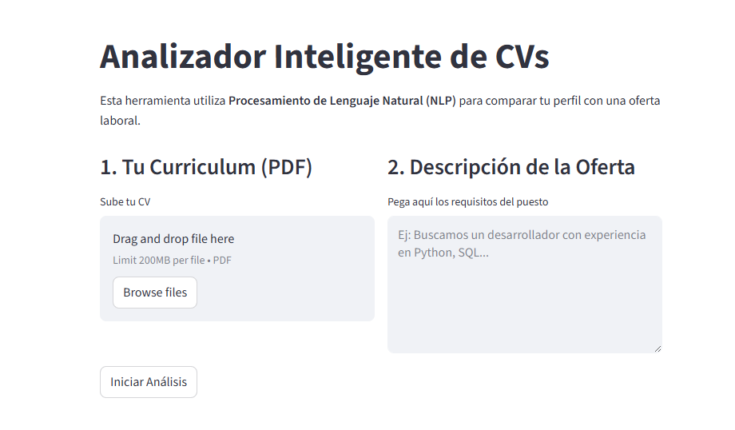

# Analizador de CVs

Este proyecto es una herramienta de análisis de currículums desarrollada con **Python**. Su objetivo es comparar el perfil profesional de un candidato (en formato PDF) con una descripción de oferta de empleo, extrayendo información clave mediante procesamiento de lenguaje natural para determinar el nivel de compatibilidad.

---

## Características

- Extracción de Texto Automatizada: Procesamiento de archivos PDF para extraer el contenido textual de forma limpia, ignorando metadatos innecesarios.
- Algoritmo de Match Score: Cálculo matemático de similitud entre el CV y la vacante utilizando la técnica de Similitud de Coseno.
- Análisis Semántico Avanzado:
  - Lemmatización: El sistema identifica raíces de palabras para que, por ejemplo, "gestión" y "gestionando" cuenten como la misma habilidad.
  - Identificación de Entidades: Filtrado de sustantivos y nombres propios para centrarse en habilidades y tecnologías reales.
- Listado de palabras clave encontradas en ambos documentos.
- Identificación de Keywords faltantes, sugiriendo al usuario qué términos debería incluir para mejorar su perfil.
- Implementación de Docker y Docker Compose para asegurar que la aplicación funcione en cualquier entorno sin conflictos de dependencias.

---

## Tecnologías

- Python
- spaCy
- Streamlit
- pdfplumber
- Scikit-learn
- Docker & Docker Compose

---

## Estructura del Proyecto

```

├── app.py              
├── requirements.txt    
├── Dockerfile          
├── docker-compose.yml  

```

---

## Ejecución
Para ejecutar el proyecto mediante Docker, asegúrate de tener Docker instalado y utiliza el siguiente comando en la raíz del proyecto:

```Bash
docker-compose up --build
```
Una vez iniciado, accede a la aplicación en el navegador a través de la dirección: ```http://localhost:8501```

### Autora
Proyecto creado por **Irene Smykla Jiménez** para el aprendizaje en el desarrollo Backend y Ciencia de Datos con Python.

### Imagen del Proyecto


